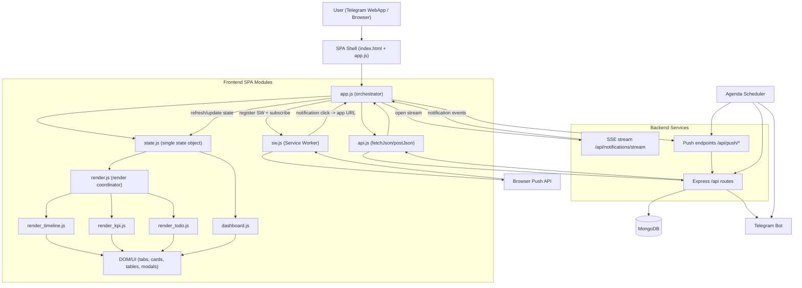

# Frontend SPA Diagram

This diagram decomposes the frontend into modules and shows the runtime flow:
`API -> state -> render`.

## Legend

- `app.js` coordinates app startup, mode switching, API calls, and event wiring.
- `state.js` is the shared runtime state; render modules consume it to update UI.
- `render.js` delegates to specialized renderers (`timeline`, `kpi`, `todo`) for DOM updates.
- Real-time events (SSE, Web Push) feed back into the same state/render cycle.
